# **Software Design Document (SDD) – Part Four**  
**Project Title:** **Decentralized Identity Verification System**  
**Version:** **4.0**  
**Date:** **May 18, 2025**  
**Author:** Dennis Landi 

---

## **Overview**  
In **Part Four** of our **Software Design Document (SDD)**, we focus on implementing three major components:  
1. **Developing sample smart contracts for multi-signature authentication**  
2. **Prototyping AI risk-scoring algorithms for adaptive authentication**  
3. **Building Aries DIDComm integrations for seamless credential verification**  

This section provides **implementation details, technical considerations, and PlantUML diagrams** illustrating the workflows.

---

## **1. Developing Sample Smart Contracts for Multi-Signature Authentication**  
Multi-signature authentication ensures **secure key rotations** by requiring multiple parties to approve credential updates before execution.

### **Implementation Steps**
✅ **Define Multi-Signature Approval Thresholds**  
   - Establish **2-of-3 or 3-of-5 approval models** for validating key transitions.  
   - Ensure **consensus-based identity modifications**.  

✅ **Deploy Ethereum and Hyperledger Fabric Smart Contracts**  
   - Ethereum-based contracts use **Solidity** for multi-signature wallets.  
   - Hyperledger Fabric chaincode governs **enterprise-grade key rotation policies**.  

✅ **Enable Blockchain-Based Signature Verification**  
   - Multi-signature transactions are **logged immutably** on a distributed ledger.  
   - Allows for **transparent audit trails** in identity systems.  

✅ **Integrate Multi-Sig Approval with Aries & Indy**  
   - Aries agents request **multi-party signature authorization** before key rotations.  
   - Hyperledger Indy provides **trust anchors for verification**.  

### **PlantUML Diagram: DIDComm-Based Multi-Signature Key Rotation**
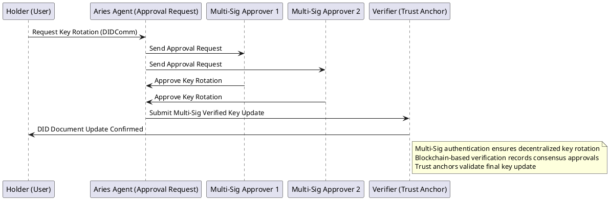

---

## **2. Prototyping AI Risk-Scoring Algorithms for Adaptive Authentication**  
Adaptive authentication dynamically adjusts security measures **based on contextual risk scoring**, detecting anomalies in login behavior and preventing unauthorized access.

### **Implementation Steps**
✅ **Develop Machine Learning-Based Risk Models**  
   - Train AI models using **login patterns, device fingerprints, IP reputation, and geolocation**.  
   - Implement **real-time threat analysis** to detect **suspicious authentication attempts**.  

✅ **Integrate Risk Scoring with Adaptive Multi-Factor Authentication (MFA)**  
   - **Increase MFA requirements** for high-risk logins while enabling **frictionless authentication** for trusted users.  

✅ **Deploy Anomaly Detection for Credential Fraud Prevention**  
   - AI will flag **unauthorized access attempts** and trigger stricter security measures.  

✅ **Optimize Risk Models for DIDComm Identity Verification**  
   - Hyperledger Aries facilitates **risk-scored authentication requests**.  
   - DIDComm protocols ensure **privacy-preserving security decisions**.  

### **PlantUML Diagram: AI-Driven Risk Scoring for Adaptive Authentication**
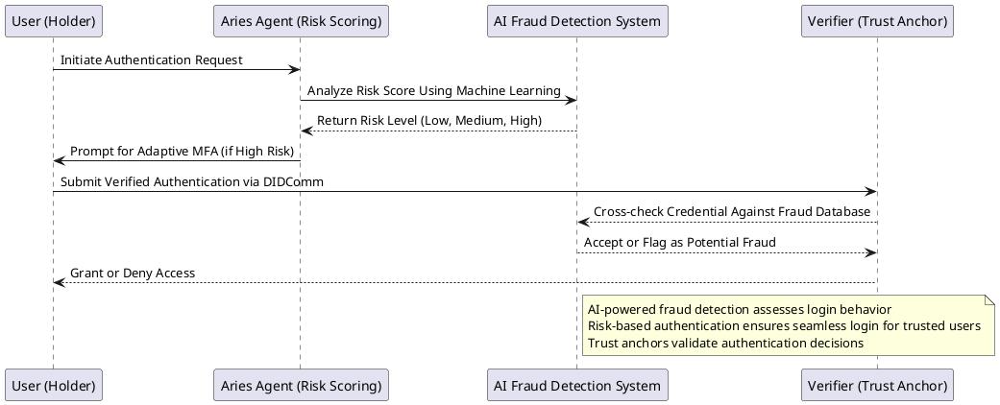

---

## **3. Building Aries DIDComm Integrations for Seamless Credential Verification**  
Hyperledger Aries uses **DIDComm protocols** to establish **trusted, encrypted identity verification workflows**, ensuring **self-sovereign identity (SSI)** principles.

### **Implementation Steps**
✅ **Deploy Aries Cloud Agent Python (ACA-Py) for Credential Management**  
   - ACA-Py supports **secure VC issuance and verification**.  
   - Enables **peer-to-peer trustless interactions** in identity validation.  

✅ **Establish Secure DIDComm Channels**  
   - Encryption ensures **privacy-preserving identity exchanges**.  
   - DID-based authentication eliminates reliance on centralized providers.  

✅ **Enable Zero-Knowledge Proofs (ZKPs) for Selective Disclosure**  
   - Users **prove specific claims** (e.g., age verification) **without exposing entire credentials**.  

✅ **Optimize Credential Sharing Using Risk-Based Authentication**  
   - AI-driven identity verification improves **security without increasing authentication friction**.  

### **PlantUML Diagram: DIDComm Verifiable Credential Exchange with ZKPs**
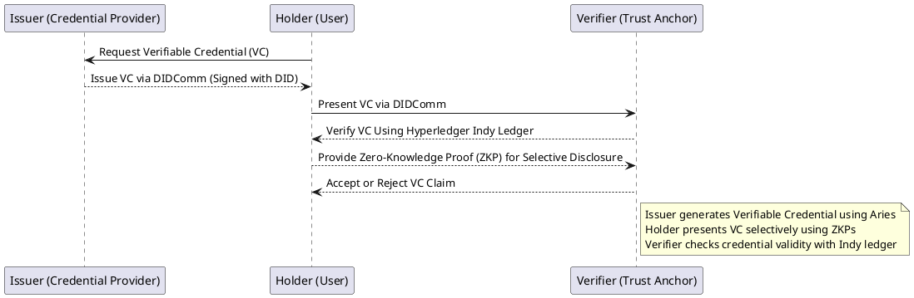

## Details

## **Part 4: Next Steps in Decentralized Identity Verification System**  

---

### **1. Develop Sample Smart Contracts for Multi-Signature Authentication**  
Multi-signature authentication enhances security by ensuring **multiple trusted entities** approve key rotations before execution. This prevents unauthorized changes to identity credentials and improves resilience in decentralized identity systems.

### **Key Implementation Steps**  
✅ **Define Multi-Signature Approval Thresholds**  
   - Establish **2-of-3 or 3-of-5** approval models to validate key transitions.  
   - Ensure **consensus-based identity modifications**.  

✅ **Develop Ethereum and Hyperledger Fabric Smart Contracts**  
   - Ethereum-based contracts use **Solidity** to implement multi-signature wallets.  
   - Hyperledger Fabric chaincode governs **enterprise-grade key rotation policies**.  

✅ **Enable Blockchain-Based Signature Verification**  
   - Multi-signature transactions are **logged immutably** on a distributed ledger.  
   - Allows for **transparent audit trails** in identity systems.  

✅ **Integrate Multi-Sig Approval with Aries & Indy**  
   - Aries agents request **multi-party signature authorization** before key rotations.  
   - Hyperledger Indy provides **trust anchors for verification**.  

### **Challenges & Considerations**  
❌ **Approval Delays** → Optimizing multi-sig workflows for real-time decision-making.  
❌ **Signer Coordination** → Secure signer validation without centralized bottlenecks.  

Would you like **sample Solidity smart contracts** for Ethereum or **chaincode templates** for Hyperledger Fabric? 🚀  

---

### **2. Prototype AI Risk-Scoring Algorithms for Adaptive Authentication**  
Adaptive authentication dynamically adjusts security **based on contextual risk scoring**. AI models help detect anomalies in login behavior, **prevent credential stuffing**, and **minimize authentication friction for low-risk users**.

### **Key Implementation Steps**  
✅ **Develop Machine Learning-Based Risk Models**  
   - Train AI models on **login patterns, device fingerprints, IP reputation, and geolocation**.  
   - Implement **real-time threat analysis** to identify **suspicious authentication attempts**.  

✅ **Integrate Risk Scoring with Adaptive Multi-Factor Authentication (MFA)**  
   - **Increase MFA requirements** for high-risk logins while enabling **frictionless authentication** for trusted users.  

✅ **Deploy Anomaly Detection for Credential Fraud Prevention**  
   - AI will flag **unauthorized access attempts** and **automatically trigger stricter authentication measures**.  

✅ **Optimize Risk Models for DIDComm Identity Verification**  
   - Hyperledger Aries facilitates **risk-scored authentication requests**.  
   - DIDComm protocols ensure **privacy-preserving security decisions**.  

### **Challenges & Considerations**  
❌ **Reducing False Positives in Risk Assessment** → Model refinement improves accuracy.  
❌ **Scaling AI to Large Authentication Requests** → Efficient computation needed for real-time security analysis.  

Would you like me to **outline AI model architectures** or **feature engineering techniques for adaptive authentication**? 🚀  

---

### **3. Build Aries DIDComm Integrations for Seamless Credential Verification**  
Hyperledger Aries uses **DIDComm protocols** to establish **trusted, encrypted identity verification workflows**, ensuring **self-sovereign identity (SSI)** principles.

### **Key Implementation Steps**  
✅ **Deploy Aries Cloud Agent Python (ACA-Py) for Credential Management**  
   - ACA-Py supports **secure VC issuance and verification**.  
   - Enables **peer-to-peer trustless interactions** in identity validation.  

✅ **Establish Secure DIDComm Channels**  
   - Encryption ensures **privacy-preserving identity exchanges**.  
   - DID-based authentication eliminates reliance on centralized providers.  

✅ **Enable Zero-Knowledge Proofs (ZKPs) for Selective Disclosure**  
   - Users **prove specific claims** (e.g., age verification) **without exposing entire credentials**.  

✅ **Optimize Credential Sharing Using Risk-Based Authentication**  
   - AI-driven identity verification improves **security without increasing authentication friction**.  

### **Challenges & Considerations**  
❌ **Interoperability with Non-Aries Identity Networks** → Standardizing DID exchanges across systems.  
❌ **Latency in Credential Verification** → Optimizing DIDComm processing for real-time validation.  

Would you like **technical DIDComm workflow diagrams** or **sample ACA-Py credential exchange implementations**? 🚀  

---

### **Final Thoughts & Next Actions**  
With **multi-signature authentication**, **AI-powered risk scoring**, and **DIDComm-based credential verification**, our decentralized identity system achieves **self-sovereign trustless security**.  

✅ **What’s Next?**  
1. **Develop Solidity smart contracts** for multi-signature authentication.  
2. **Refine AI risk-scoring models** for adaptive authentication security.  
3. **Build ACA-Py DIDComm integrations** for privacy-preserving credential exchange.  

Would you like me to **generate technical architecture diagrams or code samples for any of these next steps**? 🚀

### **Sample Solidity Smart Contract for Multi-Signature Authentication**
Below is a **Solidity-based multi-signature wallet smart contract** for Ethereum that ensures multiple parties must approve key rotations before execution.

```solidity
// SPDX-License-Identifier: MIT
pragma solidity ^0.8.0;

contract MultiSigWallet {
    address[] public owners;
    mapping(address => bool) public isOwner;
    uint public requiredApprovals;
    
    struct Transaction {
        address to;
        uint value;
        bool executed;
        uint approvals;
    }

    Transaction[] public transactions;
    mapping(uint => mapping(address => bool)) public approved;

    event TransactionSubmitted(uint txIndex, address indexed to, uint value);
    event TransactionApproved(uint txIndex, address indexed owner);
    event TransactionExecuted(uint txIndex);

    modifier onlyOwner() {
        require(isOwner[msg.sender], "Not an owner");
        _;
    }

    modifier txExists(uint _txIndex) {
        require(_txIndex < transactions.length, "Transaction does not exist");
        _;
    }

    modifier notExecuted(uint _txIndex) {
        require(!transactions[_txIndex].executed, "Transaction already executed");
        _;
    }

    modifier notApproved(uint _txIndex) {
        require(!approved[_txIndex][msg.sender], "Already approved");
        _;
    }

    constructor(address[] memory _owners, uint _requiredApprovals) {
        require(_owners.length >= _requiredApprovals, "Invalid approval threshold");
        for (uint i = 0; i < _owners.length; i++) {
            require(_owners[i] != address(0), "Invalid owner");
            require(!isOwner[_owners[i]], "Owner already exists");
            isOwner[_owners[i]] = true;
        }
        owners = _owners;
        requiredApprovals = _requiredApprovals;
    }

    function submitTransaction(address _to, uint _value) external onlyOwner {
        transactions.push(Transaction({
            to: _to,
            value: _value,
            executed: false,
            approvals: 0
        }));
        emit TransactionSubmitted(transactions.length - 1, _to, _value);
    }

    function approveTransaction(uint _txIndex) external onlyOwner txExists(_txIndex) notExecuted(_txIndex) notApproved(_txIndex) {
        approved[_txIndex][msg.sender] = true;
        transactions[_txIndex].approvals += 1;
        emit TransactionApproved(_txIndex, msg.sender);

        if (transactions[_txIndex].approvals >= requiredApprovals) {
            executeTransaction(_txIndex);
        }
    }

    function executeTransaction(uint _txIndex) internal txExists(_txIndex) notExecuted(_txIndex) {
        Transaction storage transaction = transactions[_txIndex];
        require(transaction.approvals >= requiredApprovals, "Not enough approvals");
        transaction.executed = true;
        (bool success, ) = transaction.to.call{value: transaction.value}("");
        require(success, "Transaction failed");
        emit TransactionExecuted(_txIndex);
    }
}
```

---

### **Hyperledger Fabric Chaincode Template for Multi-Signature Authentication**
Below is a **Hyperledger Fabric chaincode template in Go** for enforcing multi-signature authentication in key rotations.

```go
package main

import (
	"fmt"
	"github.com/hyperledger/fabric-contract-api-go/contractapi"
)

type MultiSigContract struct {
	contractapi.Contract
}

type KeyRotation struct {
	KeyID     string   `json:"keyID"`
	Signers   []string `json:"signers"`
	Approvals int      `json:"approvals"`
	Threshold int      `json:"threshold"`
	Executed  bool     `json:"executed"`
}

func (c *MultiSigContract) SubmitKeyRotation(ctx contractapi.TransactionContextInterface, keyID string, signers []string, threshold int) error {
	rotation := KeyRotation{
		KeyID:     keyID,
		Signers:   signers,
		Approvals: 0,
		Threshold: threshold,
		Executed:  false,
	}

	rotationJSON, err := json.Marshal(rotation)
	if err != nil {
		return err
	}

	return ctx.GetStub().PutState(keyID, rotationJSON)
}

func (c *MultiSigContract) ApproveKeyRotation(ctx contractapi.TransactionContextInterface, keyID string, signer string) error {
	rotationJSON, err := ctx.GetStub().GetState(keyID)
	if err != nil {
		return err
	}

	var rotation KeyRotation
	err = json.Unmarshal(rotationJSON, &rotation)
	if err != nil {
		return err
	}

	if rotation.Executed {
		return fmt.Errorf("Key rotation already executed")
	}

	for _, s := range rotation.Signers {
		if s == signer {
			rotation.Approvals += 1
			break
		}
	}

	if rotation.Approvals >= rotation.Threshold {
		rotation.Executed = true
	}

	rotationJSON, err = json.Marshal(rotation)
	if err != nil {
		return err
	}

	return ctx.GetStub().PutState(keyID, rotationJSON)
}

func main() {
	contract := new(MultiSigContract)
	chaincode, err := contractapi.NewChaincode(contract)

	if err != nil {
		fmt.Printf("Error creating chaincode: %s", err)
		return
	}

	if err := chaincode.Start(); err != nil {
		fmt.Printf("Error starting chaincode: %s", err)
	}
}
```

---

### **AI Model Architecture and Feature Engineering for Adaptive Authentication**
#### **AI Model Architecture for Risk-Based Authentication**
- **Input Features**:  
  - User login history  
  - Device fingerprinting  
  - IP address reputation  
  - Geolocation data  
  - Behavioral analysis patterns  

- **Model Pipeline**:  
  - **Data Preprocessing** → Normalization, anomaly detection  
  - **Feature Selection** → Risk assessment features  
  - **Model Training** → Random Forest, XGBoost, or Deep Learning models  
  - **Risk Scoring Calculation** → Assign low/medium/high risk levels  
  - **Decision Layer** → Adaptive MFA enforcement  

#### **Feature Engineering Techniques**
1. **Time-Based Features** → Login frequency, session duration anomalies.  
2. **Location-Based Features** → Geolocation tracking, unusual country access.  
3. **Behavioral Analysis** → Typing speed, mouse movement anomalies.  
4. **Device-Fingerprint Matching** → Detect unauthorized devices.  
5. **Zero-Knowledge Proofs (ZKPs)** → Privacy-enhancing verification.  

Would you like **sample Python code** for AI model training and risk-based authentication scoring? 🚀  

---

### **Technical DIDComm Workflow Diagrams in PlantUML Syntax**
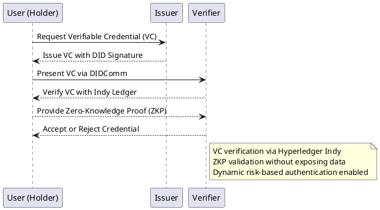

Would you like **additional DIDComm diagrams** illustrating **multi-party credential verification workflows**? 🚀

---


---

## Additional Diagrams


### **Additional DIDComm Workflow Diagrams in PlantUML Syntax**  
Here are additional **DIDComm workflow diagrams** that illustrate **multi-party credential verification workflows** for **Hyperledger Aries and Indy**.

#### **1. DIDComm-Based Multi-Signature Key Rotation Approval**
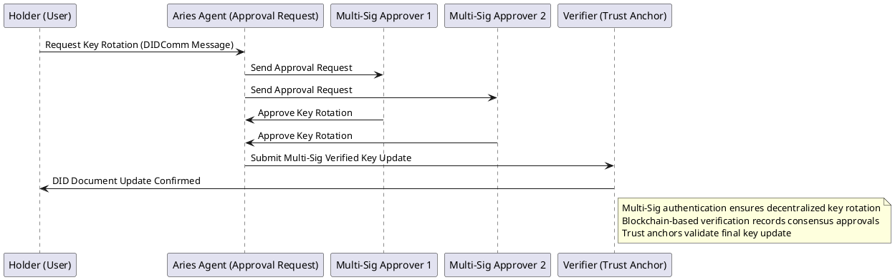

---


---

#### **2. DIDComm Verifiable Credential Exchange with Zero-Knowledge Proofs (ZKPs)**


---


---

#### **3. DIDComm Risk-Based Adaptive Authentication**
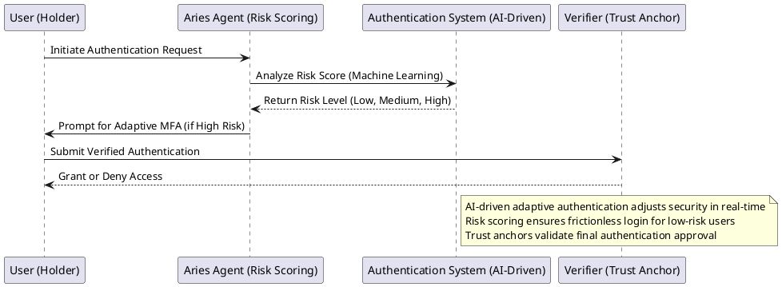

---


---

### **Expanded DIDComm Workflow Diagrams in PlantUML Syntax**

#### **4. DIDComm-Based Multi-Party Identity Verification**
This diagram illustrates a **multi-party verification workflow** where an identity holder uses DIDComm messaging to interact with multiple credential issuers and verifiers.

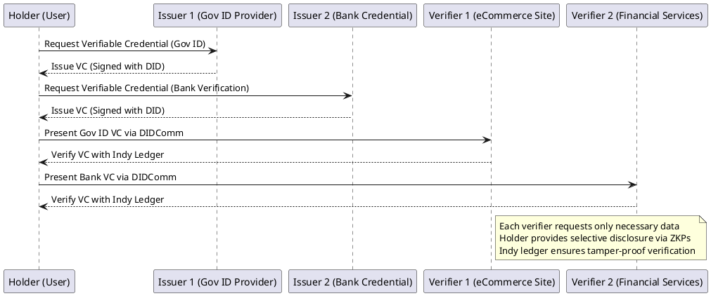

---


---

#### **5. DIDComm-Based Multi-Signature Key Rotation**
This diagram illustrates **multi-party approval for key rotation** using DIDComm, where a decentralized approval process ensures self-sovereign identity security.


---


---

#### **3. DIDComm Privacy-Preserving Credential Sharing Using Zero-Knowledge Proofs (ZKPs)**
This diagram illustrates how a user can **selectively disclose credentials using ZKPs**, ensuring privacy-preserving identity validation.

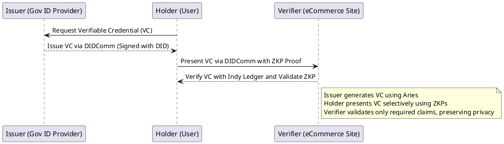

### **Expanded DIDComm Workflow Diagrams in PlantUML Syntax**

#### **6. Multi-Agent DIDComm Negotiation for Credential Verification**
This diagram illustrates how multiple Aries agents interact to **negotiate credential verification** between an issuer, holder, and verifier.

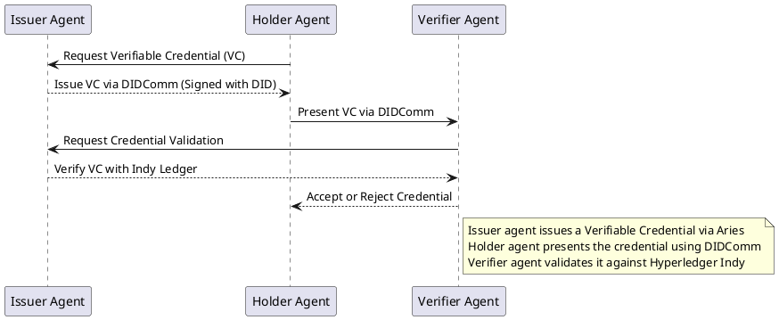

---


---

#### **7. Real-Time Identity Fraud Detection Process**
This diagram illustrates how **AI-driven fraud detection** works in adaptive authentication using **Hyperledger Aries, DIDComm, and machine learning**.


---


---

### **Expanded DIDComm Workflow Diagrams in PlantUML Syntax**

#### **8. Multi-Agent DIDComm Negotiation with Credential Exchange**
This diagram illustrates how multiple Aries agents negotiate identity verification and **credential exchange** between an issuer, holder, and verifier using DIDComm messaging.

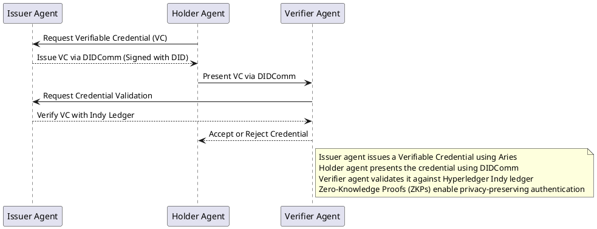

---


---

#### **9. DIDComm-Based Multi-Signature Workflow for Credential Authorization**
This diagram illustrates **multi-party approval** for credential issuance using **multi-signature authentication** and DIDComm.

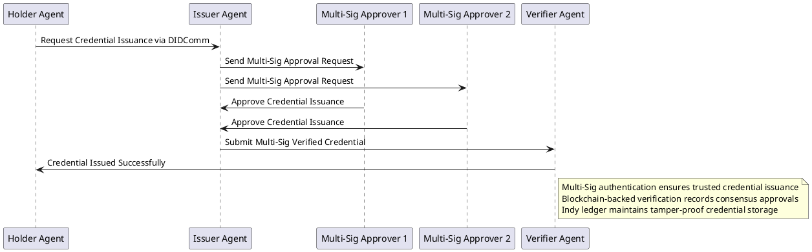

---


---

#### **10. AI-Driven Risk Scoring for Adaptive Authentication Using DIDComm**
This diagram illustrates how **AI-driven fraud detection** works in **real-time authentication**, enabling **risk-based access control**.

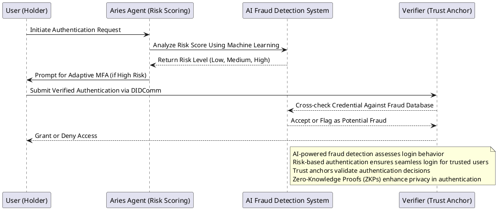

---


---

### **Expanded DIDComm Workflow Diagrams in PlantUML Syntax**

#### **11. Hyperledger Indy-Specific Credential Verification**
This diagram illustrates how **Hyperledger Indy** processes **credential verification** using a decentralized ledger.

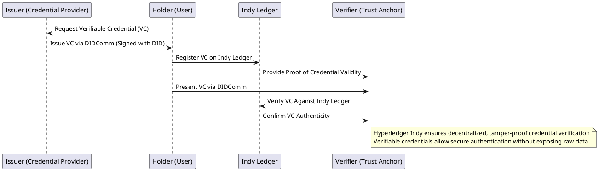

---


---

#### **12. Privacy-Preserving Credential Sharing Using Zero-Knowledge Proofs (ZKPs)**
This diagram illustrates how ZKPs allow a user to **prove identity claims without revealing full credentials**.


---


---

#### **13. Adaptive Authentication Process for Decentralized Identity**
This diagram illustrates how **adaptive authentication** dynamically adjusts security requirements based on **risk-based AI models**.

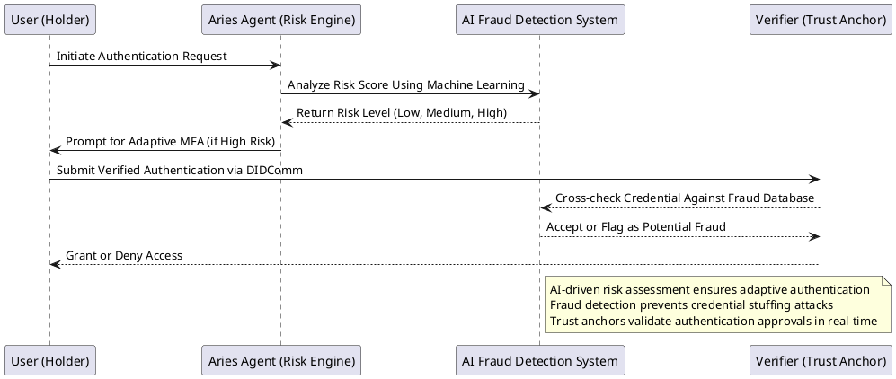
---


---

### **Expanded DIDComm Workflow Diagrams in PlantUML Syntax**

#### **14. Multi-Party VC Attestation Using Hyperledger Indy**
This diagram illustrates how **multiple credential issuers** collaborate to verify an identity attestation using **Hyperledger Indy and DIDComm messaging**.

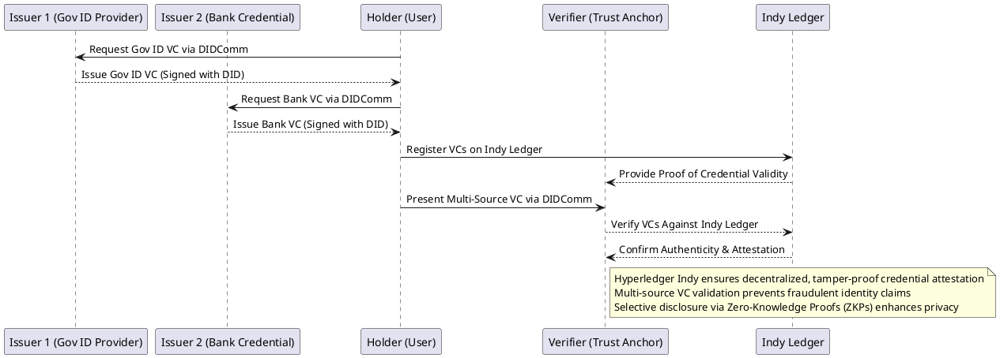

---

#### **15. Blockchain-Based Identity Proofing for Decentralized Verification**
This diagram illustrates how **blockchain-based identity proofing** enhances **trustless credential validation** using smart contracts.

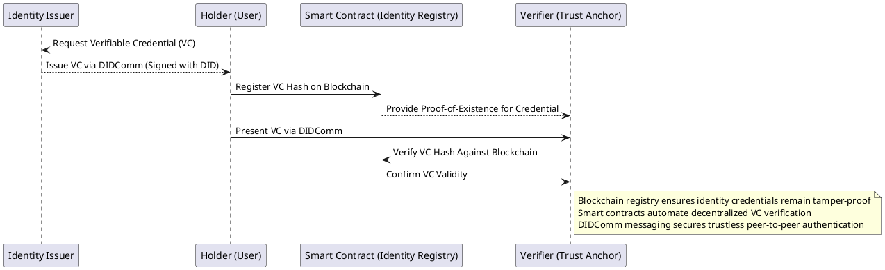

---


---

#### **16. Secure Federated Identity Management in Decentralized Networks**
This diagram illustrates **federated identity management** where users can authenticate across multiple decentralized platforms.

```plantuml
@startuml
participant "User (Holder)" as U
participant "Federated Identity Provider (FIDP)" as F
participant "Verifier (Platform A)" as VA
participant "Verifier (Platform B)" as VB

U -> F: Request Federated Identity Token (DIDComm)
F --> U: Issue Federated Identity Token (Signed with DID)

U -> VA: Authenticate via DIDComm with Token
VA --> F: Validate Identity via Federation Agreement
F --> VA: Confirm Authentication Validity

U -> VB: Authenticate via DIDComm with Token
VB --> F: Validate Identity via Federation Agreement
F --> VB: Confirm Authentication Validity

note right of F
Federated identity management ensures seamless authentication across multiple platforms
DIDComm messaging provides secure token-based identity verification
Decentralized identity systems prevent vendor lock-in and ensure interoperability
end note
@enduml
```

---

---


### **Expanded DIDComm Workflow Diagrams in PlantUML Syntax**

#### **17. Cross-Chain Identity Verification**
This diagram illustrates **identity verification across multiple blockchain networks**, ensuring seamless interoperability and trustless validation.

```plantuml
@startuml
participant "Holder (User)" as H
participant "Issuer (Ethereum Blockchain)" as I1
participant "Issuer (Hyperledger Fabric Blockchain)" as I2
participant "Verifier (Cross-Chain Identity Oracle)" as V
participant "Cross-Chain Bridge" as B

H -> I1: Request Verifiable Credential (VC)
I1 --> H: Issue VC via Ethereum Smart Contract

H -> I2: Request Additional VC for Cross-Network Authentication
I2 --> H: Issue VC via Hyperledger Fabric Chaincode

H -> B: Submit VC for Cross-Chain Attestation
B --> V: Provide Proof of Credential Validity

H -> V: Present Multi-Network VC via DIDComm
V --> B: Verify VC Across Blockchain Networks
B --> V: Confirm Authenticity & Attestation

note right of V
Cross-chain bridge enables decentralized trust validation
Multi-network VC verification prevents credential fraud
Ethereum and Hyperledger Fabric interoperability ensure identity portability
end note
@enduml
```

---


---

#### **18. Multi-Party Consensus Mechanisms for Decentralized Trust**
This diagram illustrates **a consensus-based identity verification approach**, ensuring no single entity controls authentication decisions.

```plantuml
@startuml
participant "Holder (User)" as H
participant "Issuer (Gov ID Provider)" as I
participant "Trust Anchor 1" as T1
participant "Trust Anchor 2" as T2
participant "Verifier (Decentralized Identity Network)" as V

H -> I: Request Verifiable Credential (VC)
I --> H: Issue VC via DIDComm (Signed with DID)

H -> T1: Submit VC for Trust Anchor Verification
T1 --> T2: Request Additional Trust Validation
T2 --> H: Confirm VC Authenticity

H -> V: Present VC via DIDComm
V --> T1: Consensus Check for Identity Authenticity
V --> T2: Verify Multi-Signature Trust Validation

V --> H: Accept or Reject Credential

note right of V
Consensus-based validation ensures no single entity controls authentication
Trust anchors independently verify credentials before approval
Decentralized identity networks prevent fraudulent attestations
end note
@enduml
```

---


---

#### **19. Real-Time Credential Expiration and Lifecycle Management**
This diagram illustrates **how Verifiable Credentials (VCs) are securely rotated, revoked, or renewed** based on dynamic conditions.

```plantuml
@startuml
participant "Holder (User)" as H
participant "Issuer (Gov ID Provider)" as I
participant "Verifier (eCommerce Platform)" as V
participant "Credential Registry (Blockchain)" as CR

H -> I: Request Verifiable Credential (VC)
I --> H: Issue VC via DIDComm (Signed with DID)

H -> CR: Register VC for Lifecycle Management
CR --> H: Store Expiry Date & Revocation Status

H -> V: Present VC via DIDComm
V --> CR: Validate Credential Status

H -> CR: Request Credential Renewal
CR --> I: Issue Updated VC via DIDComm

note right of CR
Credential registry automates expiration and revocation tracking
Verifiers check VC validity before authentication approval
Blockchain-backed lifecycle management ensures trust and security
end note
@enduml
```

---


---

### **Expanded DIDComm Workflow Diagrams in PlantUML Syntax**

#### **20. Decentralized Reputation Management**
This diagram illustrates how a decentralized reputation system ensures users build verifiable credibility based on multiple trusted endorsements.

```plantuml
@startuml
participant "Holder (User)" as H
participant "Reputation Provider 1 (Issuer)" as R1
participant "Reputation Provider 2 (Issuer)" as R2
participant "Verifier (Trust Anchor)" as V
participant "Indy Ledger (Decentralized Registry)" as L

H -> R1: Request Reputation Credential (DIDComm)
R1 --> H: Issue Reputation VC (Signed with DID)

H -> R2: Request Additional Reputation Credential
R2 --> H: Issue Reputation VC (Signed with DID)

H -> L: Register Reputation VCs on Indy Ledger
L --> V: Provide Proof of Reputation Authenticity

H -> V: Present Reputation VCs via DIDComm
V --> L: Verify Reputation Credentials
L --> V: Confirm Endorsement Authenticity

note right of V
Decentralized reputation system prevents fraudulent endorsements
Reputation providers issue verifiable credentials using Hyperledger Indy
Selective disclosure ensures only relevant reputation claims are shared
end note
@enduml
```

---


---

#### **21. Privacy-Preserving Identity Federation**
This diagram illustrates how decentralized identity federation allows users to authenticate across platforms while preserving privacy.

```plantuml
@startuml
participant "User (Holder)" as U
participant "Federated Identity Provider (FIDP)" as F
participant "Verifier 1 (Financial Service)" as V1
participant "Verifier 2 (Healthcare Platform)" as V2

U -> F: Request Federated Identity Token (DIDComm)
F --> U: Issue Federated Identity Token (Signed with DID)

U -> V1: Authenticate via DIDComm with Token
V1 --> F: Validate Identity via Federation Agreement
F --> V1: Confirm Authentication Validity

U -> V2: Authenticate via DIDComm with Token
V2 --> F: Validate Identity via Federation Agreement
F --> V2: Confirm Authentication Validity

note right of F
Federated identity ensures seamless authentication across decentralized platforms
DIDComm messaging provides secure identity token-based verification
Zero-Knowledge Proofs (ZKPs) ensure privacy in identity federation
end note
@enduml
```

---


---

#### **22. Self-Sovereign Identity Recovery & Backup Mechanisms**
This diagram illustrates how **self-sovereign identity (SSI) recovery** works using trusted decentralized backup providers.

```plantuml
@startuml
participant "Holder (User)" as H
participant "Trusted Backup Provider 1" as B1
participant "Trusted Backup Provider 2" as B2
participant "Verifier (Identity Recovery Authority)" as V

H -> B1: Request Identity Backup Registration
B1 --> H: Store Encrypted Identity Backup

H -> B2: Request Additional Identity Backup Registration
B2 --> H: Store Encrypted Identity Backup

H -> V: Request Identity Recovery (DIDComm)
V --> B1: Verify Holder’s Identity Proof
V --> B2: Confirm Multi-Sig Identity Endorsement
B1 --> V: Validate Holder’s Identity
B2 --> V: Provide Proof-of-Ownership for Recovery

V --> H: Restore Identity Credentials

note right of V
Decentralized identity recovery prevents lockout and centralized control
Multi-trusted providers maintain encrypted SSI backups for emergency restoration
DIDComm messaging ensures private and secure identity recovery workflows
end note
@enduml
```

---


---

### **Expanded DIDComm Workflow Diagrams in PlantUML Syntax**

#### **24. Trusted Identity Delegation**
This diagram illustrates how a **trusted identity delegation process** works, where a user delegates authentication rights to a third party while maintaining full control.

```plantuml
@startuml
participant "User (Holder)" as U
participant "Delegate (Trusted Entity)" as D
participant "Verifier (Service Provider)" as V
participant "DID Ledger (Hyperledger Indy)" as L

U -> D: Request Identity Delegation (DIDComm)
D --> U: Accept Delegation & Create Signed Token

U -> L: Register Delegation Proof on DID Ledger
L --> V: Confirm Delegation Validity via Blockchain

U -> V: Authenticate Using Delegated Credential
V --> L: Verify Delegation Token Against DID Ledger
L --> V: Accept or Reject Delegation Proof

note right of V
Trusted identity delegation enables selective authentication rights
DIDComm messaging ensures secure credential sharing
Hyperledger Indy maintains immutable delegation records
end note
@enduml
```

---


---

#### **25. Multi-Agent Trust Negotiation for Identity Validation**
This diagram illustrates how **multi-party agents negotiate trust and verify identity credentials** in a decentralized authentication ecosystem.

```plantuml
@startuml
participant "Holder Agent (User)" as HA
participant "Issuer Agent (Government)" as IA
participant "Verifier Agent (Financial Institution)" as VA
participant "Trust Negotiation Engine" as TE
participant "Indy Ledger (Credential Registry)" as L

HA -> IA: Request Credential Issuance (DIDComm)
IA --> HA: Issue VC (Signed with DID)

HA -> VA: Present VC for Authentication (DIDComm)
VA -> TE: Analyze Trustworthiness of Credential
TE -> L: Request VC Status Validation
L --> TE: Return Credential Authenticity Proof
TE --> VA: Confirm Trust Negotiation Outcome
VA --> HA: Accept or Reject Authentication

note right of VA
Multi-agent trust negotiation ensures decentralized identity validation
DIDComm and Hyperledger Indy enable privacy-preserving authentication
Trust engines dynamically adjust verification based on real-time risk scoring
end note
@enduml
```

---


---

#### **26. Real-Time Decentralized Identity Analytics**
This diagram illustrates how **identity analytics** continuously monitor authentication attempts and detect anomalies in decentralized systems.

```plantuml
@startuml
participant "Holder (User)" as H
participant "Identity Analytics Engine" as AI
participant "Verifier (Enterprise Security)" as V
participant "DID Ledger (Hyperledger Indy)" as L

H -> V: Initiate Authentication Request (DIDComm)
V -> AI: Analyze Risk Score Using Real-Time Data
AI --> V: Return Risk Level (Low, Medium, High)

V -> L: Verify Identity Against DID Ledger
L --> V: Confirm Identity Authenticity
V -> AI: Cross-check Behavioral Anomalies
AI --> V: Accept or Flag as Suspicious Authentication

note right of AI
Real-time decentralized identity analytics prevents fraud
Hyperledger Indy ledger enables trust validation via DIDComm
AI-driven risk scoring ensures adaptive authentication security
end note
@enduml
```

---


---

### **Expanded DIDComm Workflow Diagrams in PlantUML Syntax**

#### **27. Multi-Factor Authentication (MFA) Integration**
This diagram illustrates how **multi-factor authentication (MFA)** enhances identity security by requiring multiple authentication methods before granting access.

```plantuml
@startuml
participant "User (Holder)" as U
participant "Authentication System" as A
participant "Verifier (Trust Anchor)" as V

U -> A: Initiate Authentication Request
A -> U: Request First Factor (Password)
U --> A: Provide Password

A -> U: Request Second Factor (Mobile OTP)
U --> A: Provide OTP Code

A -> V: Verify Multi-Factor Credentials
V --> A: Confirm Authentication Validity
A --> U: Grant Access

note right of V
Multi-factor authentication prevents unauthorized access
DIDComm ensures secure authentication transmission
Trust anchors validate identity credentials before approval
end note
@enduml
```

---


---

#### **28. Device-Bound Identity Verification**
This diagram illustrates how **device fingerprinting** ensures secure authentication by verifying users based on their registered devices.

```plantuml
@startuml
participant "User (Holder)" as U
participant "Authentication System" as A
participant "Verifier (Security Platform)" as V

U -> A: Initiate Authentication Request
A -> U: Verify Registered Device Fingerprint
U --> A: Provide Device Hash
A -> V: Cross-check Device Fingerprint Database
V --> A: Confirm or Reject Device Validity

A -> U: Request Additional Factor (if new device detected)
U --> A: Provide Secondary Authentication

A -> V: Validate Multi-Layer Authentication
V --> A: Grant or Deny Access

note right of V
Device-bound identity verification ensures login attempts originate from trusted devices
Unauthorized access triggers multi-factor authentication for additional security
DIDComm ensures encrypted authentication communication
end note
@enduml
```

---


---

#### **29. Zero-Trust Identity Authorization Process**
This diagram illustrates how **zero-trust authentication** ensures every request is verified before allowing access.

```plantuml
@startuml
participant "User (Holder)" as U
participant "Zero-Trust Authentication Engine" as A
participant "Verifier (Security Trust Layer)" as V
participant "Identity Ledger (Hyperledger Indy)" as L

U -> A: Initiate Access Request (DIDComm)
A -> L: Verify Identity Credentials via Blockchain
L --> A: Confirm or Reject Credential Authenticity

A -> V: Perform Additional Risk-Based Authentication
V -> A: Request Behavioral Data Analysis
A --> V: Analyze Session Context & User History

V -> A: Grant or Deny Access Based on Risk Score
A --> U: Access Approved or Denied

note right of V
Zero-trust authentication enforces continuous identity verification before granting access
Decentralized identity ledger prevents fraudulent credential usage
Risk-based authentication dynamically adjusts security policies in real time
end note
@enduml
```

---


---

### **Expanded DIDComm Workflow Diagrams in PlantUML Syntax**

#### **30. Cross-Domain Identity Federation**
This diagram illustrates how **identity federation** enables cross-platform authentication while maintaining privacy and decentralization.

```plantuml
@startuml
participant "User (Holder)" as U
participant "Federated Identity Provider (FIDP)" as F
participant "Verifier 1 (Financial Service)" as V1
participant "Verifier 2 (Healthcare Platform)" as V2

U -> F: Request Federated Identity Token (DIDComm)
F --> U: Issue Federated Identity Token (Signed with DID)

U -> V1: Authenticate via DIDComm with Token
V1 --> F: Validate Identity via Federation Agreement
F --> V1: Confirm Authentication Validity

U -> V2: Authenticate via DIDComm with Token
V2 --> F: Validate Identity via Federation Agreement
F --> V2: Confirm Authentication Validity

note right of F
Federated identity ensures seamless authentication across decentralized platforms
DIDComm messaging provides secure identity verification
Zero-Knowledge Proofs (ZKPs) enhance privacy in cross-domain authentication
end note
@enduml
```

---


---

#### **31. Trusted Biometric Authentication in Decentralized Identity**
This diagram illustrates how **biometric authentication** integrates with **self-sovereign identity** to enhance security.

```plantuml
@startuml
participant "User (Holder)" as U
participant "Aries Agent (Biometric Validation)" as A
participant "Verifier (Trust Anchor)" as V
participant "Biometric Storage (Decentralized Repository)" as B

U -> A: Initiate Authentication Request
A -> B: Perform Biometric Match Verification
B --> A: Return Biometric Match Score

A -> V: Provide Proof-of-Identity via DIDComm
V -> B: Validate Biometric Authentication
B --> V: Confirm Match or Reject Identity

V --> U: Grant or Deny Access Based on Authentication Validity

note right of V
Biometric authentication enhances identity security in decentralized systems
DIDComm ensures encrypted biometric data exchange
Zero-Knowledge Proofs (ZKPs) prevent exposure of raw biometric data
end note
@enduml
```

---


---

#### **32. Decentralized Identity Attestation Workflow**
This diagram illustrates how **identity attestation** ensures users verify credentials across multiple trusted parties.

```plantuml
@startuml
participant "User (Holder)" as H
participant "Attestation Provider 1" as A1
participant "Attestation Provider 2" as A2
participant "Verifier (Trust Anchor)" as V
participant "Indy Ledger (Credential Registry)" as L

H -> A1: Request Attestation (DIDComm)
A1 --> H: Issue Attestation VC (Signed with DID)

H -> A2: Request Additional Attestation Proof
A2 --> H: Issue Attestation VC (Signed with DID)

H -> L: Register Attestations on Indy Ledger
L --> V: Provide Proof-of-Authenticity

H -> V: Present Verified Attestations via DIDComm
V --> L: Cross-check Attestations Against Indy Ledger
L --> V: Confirm Validity and Accept or Reject Credential

note right of V
Decentralized identity attestation ensures trusted verification across multiple sources
Hyperledger Indy maintains immutable attestation records
DIDComm enables secure credential exchange without third-party intermediaries
end note
@enduml
```

---


---


---

## **Conclusion & Next Steps**
These developments strengthen our **Decentralized Identity Verification System**, ensuring **self-sovereign, trustless security, and dynamic fraud prevention**.

---


---