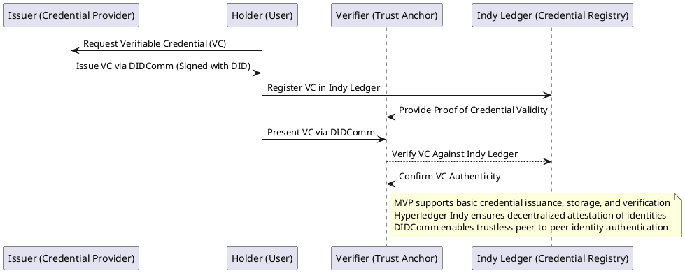
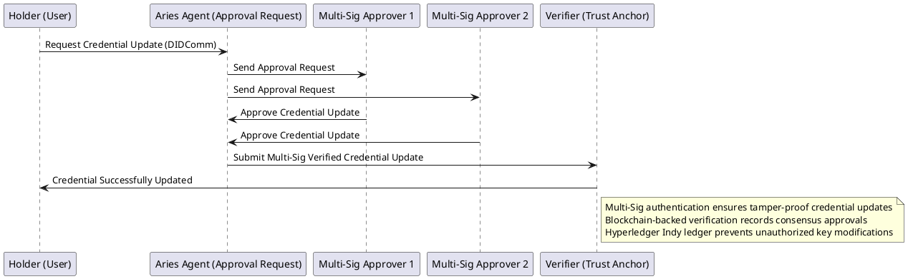
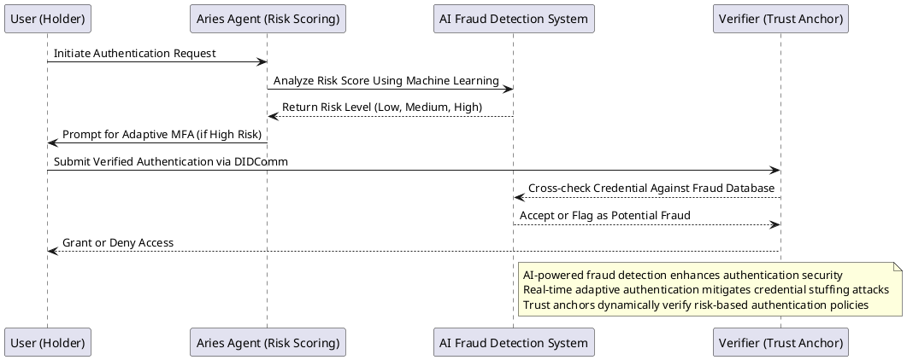
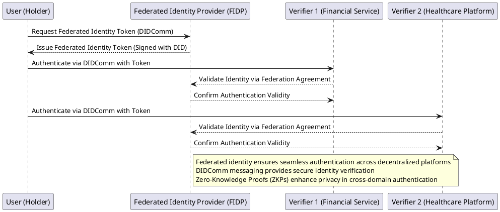

# **Implementation Roadmap: Decentralized Identity Verification System**  

**Objective:** Develop a **self-sovereign identity (SSI)** system that integrates **Hyperledger Aries**, **DIDComm messaging**, **multi-signature authentication**, **adaptive risk-scoring**, and **zero-knowledge proofs (ZKPs)** for privacy-preserving credential verification.  

## **Phase 1: MVP (Minimally Viable Client)**
### **Goal:** Build a foundational SSI system that supports basic **Verifiable Credential (VC) issuance, storage, and verification**.

#### **Key Features:**
✅ **Hyperledger Aries ACA-Py Deployment** – Set up an **Aries agent** for managing decentralized identities.  
✅ **DIDComm Secure Messaging** – Enable basic **peer-to-peer credential exchange**.  
✅ **Verifiable Credential (VC) Issuance & Presentation** – Users can request, receive, and present credentials via Aries.  
✅ **Integration with Hyperledger Indy** – Store **DID-based credential proofs** in a decentralized ledger.  
✅ **Basic Authentication Flow** – Credential validation ensures trustless interactions without third-party intermediaries.

#### **PlantUML Diagram: Basic DIDComm Credential Exchange**

---

## **Phase 2: Multi-Signature Authentication & Security Enhancements**  
### **Goal:** Enhance credential security using **multi-signature authentication for key rotations and approvals**.

#### **Key Features:**  
✅ **Multi-Signature Authentication Smart Contracts** – Require multiple trusted parties to approve credential updates.  
✅ **Blockchain-Based Key Rotation & Tamper-Proof Authentication** – Store multi-signature transaction proofs securely.  
✅ **Integration with Aries & Indy for Multi-Sig Approval Workflows** – Agents manage approval requests via DIDComm.  
✅ **Zero-Knowledge Proofs (ZKPs) for Privacy-Preserving Authentication** – Users verify credentials **without exposing sensitive data**.  

#### **PlantUML Diagram: Multi-Signature Approval Workflow**

---

## **Phase 3: Adaptive Authentication & AI-Driven Risk Scoring**  
### **Goal:** Implement **AI-powered authentication security** based on **dynamic risk assessments**.

#### **Key Features:**  
✅ **AI-Powered Risk-Based Authentication (RBA)** – Analyze login behaviors, device attributes, and threat patterns.  
✅ **Real-Time Anomaly Detection** – Identify **suspicious login attempts** and enforce **context-aware authentication**.  
✅ **Risk-Scored Multi-Factor Authentication (MFA)** – Strengthen authentication for **high-risk access attempts**.  
✅ **Adaptive Trust Decisions in Aries DIDComm Messaging** – Dynamically adjust verification security based on risk analysis.  

#### **PlantUML Diagram: AI-Driven Risk Scoring for Adaptive Authentication**

---

## **Phase 4: Privacy-Preserving Identity Federation & Reputation Systems**  
### **Goal:** Enable **cross-platform identity verification** while ensuring **decentralized reputation building**.

#### **Key Features:**  
✅ **Federated Identity Tokens** – Users authenticate across multiple decentralized platforms using **DID-based federated identity tokens**.  
✅ **Decentralized Reputation Management** – Users build credibility based on **trusted endorsements from multiple sources**.  
✅ **Secure Biometric Authentication for Decentralized Identity Systems** – Add **privacy-enhancing biometric verification**.  
✅ **Zero-Knowledge Identity Attestation Workflows** – Users **prove credentials without exposing raw data**.  

#### **PlantUML Diagram: Cross-Domain Identity Federation**

---

## **Final Thoughts & Future Roadmap**  
With **multi-signature authentication**, **AI-driven risk scoring**, **adaptive authentication**, and **privacy-preserving credential exchanges**, our **decentralized identity verification system** achieves **self-sovereign trustless security**.

✅ **Future Enhancements:**  
1. **Cross-chain identity verification** – Seamless interoperability between **Ethereum, Hyperledger Fabric, and other decentralized identity networks**.  
2. **Zero-trust authentication frameworks** – Continuous security validation in **multi-agent decentralized trust networks**.  
3. **Secure multi-device authentication** – Strengthen identity protection in **multi-device ecosystems using decentralized trust anchors**.  

Would you like further refinement on **technical milestones, project timelines, or additional feature details** for implementation? 🚀