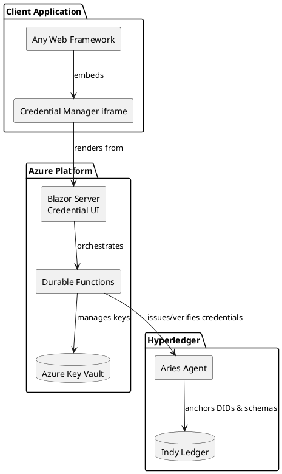
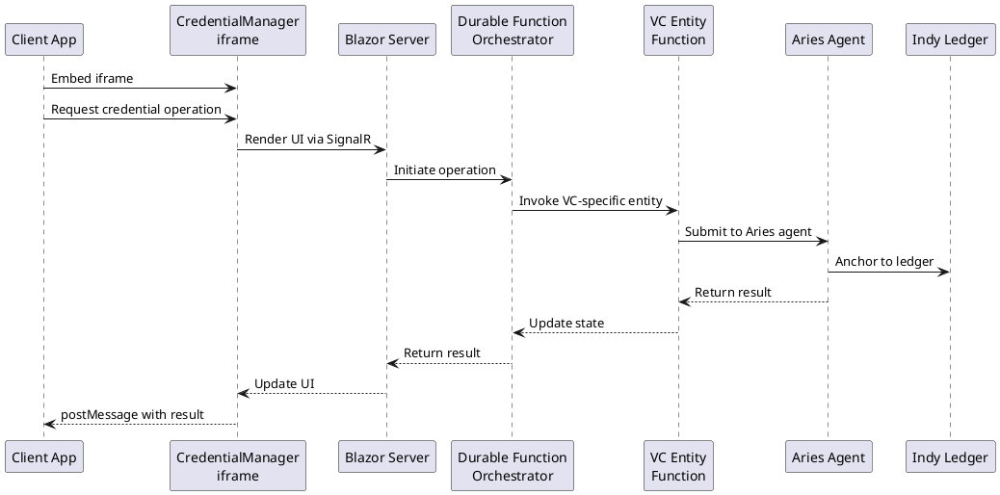
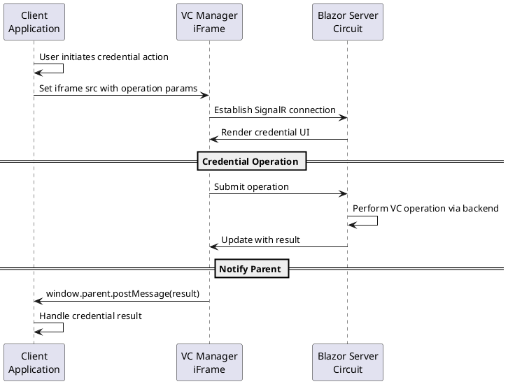
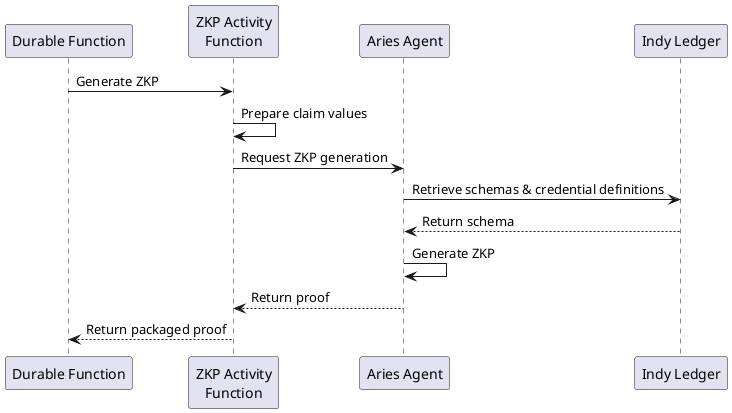
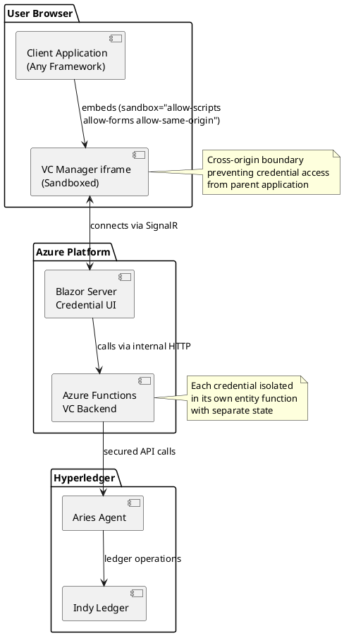
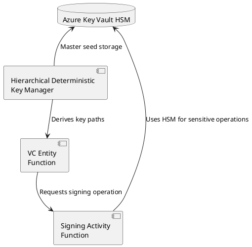
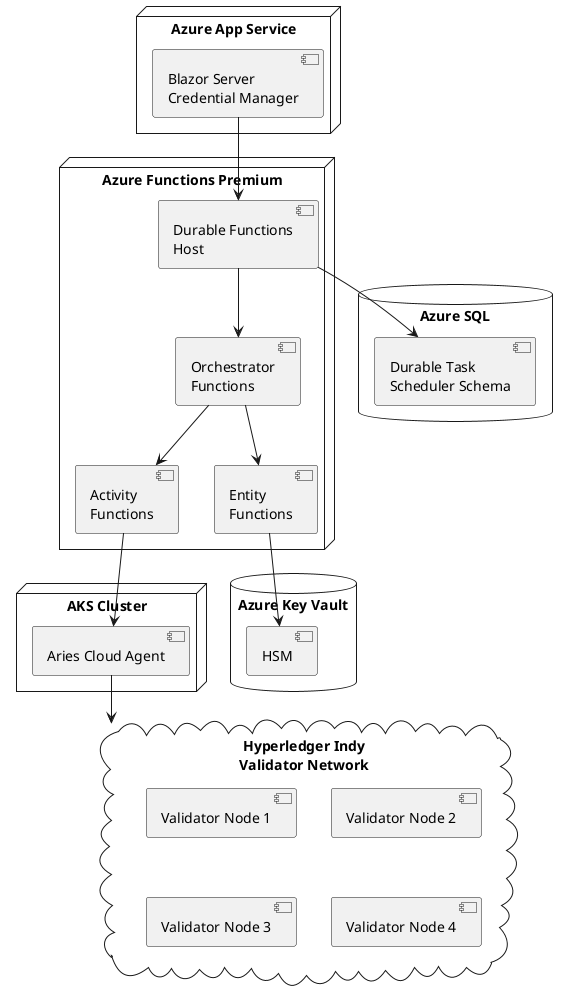
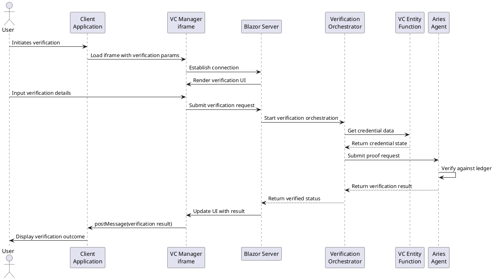

# Software Design Document: Decentralized Authentication with LimboDancer Front-end and Canary Backend

## 1. Executive Overview

Decentralized Authentication with LimboDancer integrates the cross-platform client architecture of LimboDancer with Hyperledger's decentralized identity stack (Aries, Indy) and Azure Durable Functions. This creates a truly decentralized, framework-agnostic identity system where:

- **Security** is maximized by isolating credential operations in a sandboxed iframe
- **Interoperability** is achieved through framework-agnostic client integration
- **Scalability** is ensured via Azure Durable Functions acting as isolated VC agents
- **Trust** is decentralized using Hyperledger Indy's distributed ledger

### Core Architecture



## 2. System Overview

### 2.1 Core Business Purpose

The platform enables decentralized identity verification through Verifiable Credentials (VCs) while providing a consistent, secure user experience across any client framework. Unlike traditional Single Sign-On, each credential exists as an isolated entity under user control, with attestations anchored to a distributed ledger.

### 2.2 Key Requirements

- Framework-agnostic client integration
- One agent per VC for security isolation
- Serverless scalability for millions of credentials
- Cryptographic operations compatible with serverless constraints
- Cross-origin security boundary between clients and credential operations

### 2.3 Data Flow



## 3. Credential Management Architecture

### 3.1 VC Entity Functions

Each Verifiable Credential is represented by a dedicated Durable Entity Function:

```csharp
[FunctionName("VerifiableCredentialEntity")]
public static void RunEntity([EntityTrigger] IDurableEntityContext ctx)
{
    var operations = new Dictionary<string, Func<Task>>
    {
        ["issue"] = async () => {
            var claims = ctx.GetInput<Dictionary<string, string>>();
            var issuer = ctx.EntityKey; // Entity ID is the issuer DID
            await IssueCredentialCore(ctx.GetState<CredentialState>(), claims, issuer);
        },
        ["verify"] = async () => {
            var request = ctx.GetInput<VerificationRequest>();
            await VerifyCredentialCore(ctx.GetState<CredentialState>(), request);
        },
        ["revoke"] = async () => {
            await RevokeCredentialCore(ctx.GetState<CredentialState>());
        }
    };

    if (operations.TryGetValue(ctx.OperationName.ToLowerInvariant(), out var operation))
        operation();
}
```

### 3.2 LimboDancer Client Integration

The client-side follows LimboDancer's iframe pattern:

```html
<iframe
  src="https://vc.example.com/credential-manager/"
  title="Credential Manager"
  sandbox="allow-scripts allow-forms allow-same-origin"
  width="100%" height="480"
  referrerpolicy="no-referrer"
  csp="default-src 'self'; connect-src 'self' https://vc-api.example.com">
</iframe>
```

### 3.3 Cross-Origin Communication Flow



## 4. Implementation Details

### 4.1 Blazor Server Credential Manager

```csharp
// CredentialManager.razor
@page "/credential-manager"
@using Microsoft.JSInterop
@inject ICredentialService CredentialService
@inject IJSRuntime JS

<div class="credential-container @_operationMode">
    @switch (_operationMode)
    {
        case "issue":
            <IssueCredentialForm Claims="@_claims" OnIssue="HandleIssue" />
            break;
        case "verify":
            <VerifyCredentialForm CredentialId="@_credentialId" OnVerify="HandleVerify" />
            break;
        case "view":
            <CredentialViewer CredentialId="@_credentialId" />
            break;
    }
</div>

@code {
    private string _operationMode;
    private string _credentialId;
    private Dictionary<string, string> _claims;

    protected override async Task OnInitializedAsync()
    {
        var parameters = await JS.InvokeAsync<Dictionary<string, string>>("getQueryParams");
        _operationMode = parameters.GetValueOrDefault("mode", "view");
        _credentialId = parameters.GetValueOrDefault("id", "");
        
        if (parameters.TryGetValue("claims", out var claimsJson))
            _claims = JsonSerializer.Deserialize<Dictionary<string, string>>(claimsJson);
    }

    private async Task HandleIssue(Dictionary<string, string> claims)
    {
        var result = await CredentialService.IssueCredentialAsync(claims);
        await NotifyParent("credential-issued", result);
    }

    private async Task HandleVerify(VerificationResult result)
    {
        await NotifyParent("verification-result", result);
    }

    private async Task NotifyParent(string type, object data)
    {
        await JS.InvokeVoidAsync("window.parent.postMessage", 
            new { type, data }, "*");
    }
}
```

### 4.2 Durable Function Orchestrators

```csharp
[FunctionName("IssueCredentialOrchestrator")]
public static async Task<CredentialResult> RunOrchestrator(
    [OrchestrationTrigger] IDurableOrchestrationContext context)
{
    var request = context.GetInput<IssueRequest>();
    
    // Step 1: Generate cryptographic material using activity function
    var keyMaterial = await context.CallActivityAsync<KeyMaterial>(
        "GenerateCredentialKeys", null);
    
    // Step 2: Create DID on Indy ledger
    var didInfo = await context.CallActivityAsync<DIDInfo>(
        "RegisterDID", keyMaterial);
    
    // Step 3: Create credential entity
    var entityId = new EntityId("VerifiableCredential", didInfo.Did);
    await context.CallEntityAsync(entityId, "initialize", new CredentialInitData {
        KeyMaterial = keyMaterial,
        DidInfo = didInfo
    });
    
    // Step 4: Issue credential with claims
    await context.CallEntityAsync(entityId, "issue", request.Claims);
    
    // Step 5: Get issued credential details
    var credentialData = await context.CallEntityAsync<CredentialData>(
        entityId, "get");
    
    return new CredentialResult {
        CredentialId = didInfo.Did,
        IssuanceDate = context.CurrentUtcDateTime,
        Type = request.Type,
        Claims = request.Claims
    };
}
```

### 4.3 CredentialManager.js

```javascript
const CredentialManager = (function () {
    const CREDENTIALS_KEY = 'stored_credentials';
    
    // Store issued credential
    function storeCredential(credential) {
        const credentials = getCredentials();
        credentials.push(credential);
        localStorage.setItem(CREDENTIALS_KEY, JSON.stringify(credentials));
    }
    
    // Get all stored credentials
    function getCredentials() {
        const stored = localStorage.getItem(CREDENTIALS_KEY);
        return stored ? JSON.parse(stored) : [];
    }
    
    // Initiate verification in iframe
    async function verifyCredential(credentialId) {
        return new Promise((resolve) => {
            const iframe = document.getElementById('credential-iframe');
            iframe.src = `https://vc.example.com/credential-manager?mode=verify&id=${credentialId}`;
            iframe.style.display = 'block';
            
            window.addEventListener('message', function handler(e) {
                if (e.origin !== 'https://vc.example.com') return;
                if (e.data?.type === 'verification-result') {
                    window.removeEventListener('message', handler);
                    resolve(e.data.data);
                }
            });
        });
    }
    
    return {
        storeCredential,
        getCredentials,
        verifyCredential
    };
})();
```

## 5. Hyperledger Integration

### 5.1 Zero-Knowledge Proof Architecture



### 5.2 Aries Agent Integration

```csharp
public class AriesService
{
    private readonly HttpClient _httpClient;
    private readonly string _agentEndpoint;
    
    public async Task<VerifiableCredential> IssueCredentialAsync(
        string issuerDid, 
        Dictionary<string, string> claims,
        string schemaId)
    {
        var request = new IssueCredentialRequest {
            IssuerDid = issuerDid,
            SchemaId = schemaId,
            Claims = claims
        };
        
        var response = await _httpClient.PostAsync(
            $"{_agentEndpoint}/issue-credential",
            new StringContent(JsonSerializer.Serialize(request)));
        
        response.EnsureSuccessStatusCode();
        
        return await response.Content.ReadFromJsonAsync<VerifiableCredential>();
    }
    
    public async Task<bool> VerifyProofAsync(
        string proofRequestJson,
        string proofJson)
    {
        var request = new VerifyProofRequest {
            ProofRequest = proofRequestJson,
            Proof = proofJson
        };
        
        var response = await _httpClient.PostAsync(
            $"{_agentEndpoint}/verify-proof",
            new StringContent(JsonSerializer.Serialize(request)));
        
        response.EnsureSuccessStatusCode();
        
        var result = await response.Content.ReadFromJsonAsync<VerifyProofResponse>();
        return result.IsValid;
    }
}
```

## 6. Security Architecture

### 6.1 Cross-Origin Isolation Model



### 6.2 Key Management Architecture



## 7. Deployment Architecture



## 8. Credential Verification Flow



## 9. Cost Analysis

### Azure Services

| Service | Size/Tier | Monthly Cost | Notes |
|---------|-----------|--------------|-------|
| Azure App Service | Standard S1 (2 instances) | $146 | Hosts Blazor Server VC Manager UI |
| Azure Functions | Premium EP1 (2 instances) | $365 | Required for Durable Entity resilience |
| Azure SQL Database | Standard S1 | $150 | Durable Task Scheduler backend |
| Azure Key Vault | Standard + HSM operations | $120 | Includes 5,000 HSM operations/month |
| Azure Bandwidth | 500 GB | $45 | Outbound data transfer |
| Azure Monitor | 100 GB ingested | $230 | Logging and monitoring |
| **Azure Subtotal** | | **$1,056** | |

### Hyperledger Infrastructure

| Component | Size/Configuration | Monthly Cost | Notes |
|-----------|-------------------|--------------|-------|
| AKS Cluster | 3 nodes (D4s v3) | $438 | Hosts Aries Cloud Agents |
| Indy Validator Nodes | 4 nodes (D4s v3) | $584 | Minimum for consensus |
| Storage (Premium SSD) | 4 TB total | $460 | Ledger and agent storage |
| Load Balancer | Standard | $23 | Agent access |
| **Hyperledger Subtotal** | | **$1,505** | |

### Scaling Considerations

| Scale Level | VC Volume | Monthly Cost | Key Drivers |
|-------------|-----------|--------------|------------|
| Small (10K VCs) | 10,000 | $2,561 | Base infrastructure costs |
| Medium (100K VCs) | 100,000 | $3,026 | Added storage, operations |
| Large (1M VCs) | 1,000,000 | $5,290 | Increased compute, storage, operations |
| Enterprise (10M+ VCs) | 10,000,000+ | $12,500+ | Multiple clusters, premium tiers |

### Cost Optimization Strategies

1. **Development/Test Environments**
   - Use Consumption plan Functions ($0.20/million executions)
   - Deploy single-node Indy network for testing
   - Estimated development environment cost: $750/month

2. **Production Optimization**
   - Reserved Instances: 40% savings on compute ($550/month savings)
   - Auto-scaling during low-demand periods
   - Tiered storage for credential history

3. **Multi-Tenant Deployment**
   - Share Hyperledger infrastructure across customers
   - Amortized cost could reach $0.10-0.30 per credential/month

### Total Cost of Ownership (3-Year)

For a medium-scale deployment (100K VCs):
- Initial deployment: $3,026/month
- With Azure Reserved Instances (Year 1): $2,476/month
- With operational optimization (Year 2): $2,150/month
- Amortized 3-year TCO: ~$2,350/month ($28,200/year)

This cost structure enables a sustainable business model while maintaining the security benefits of isolated credential agents and decentralized verification through Hyperledger.