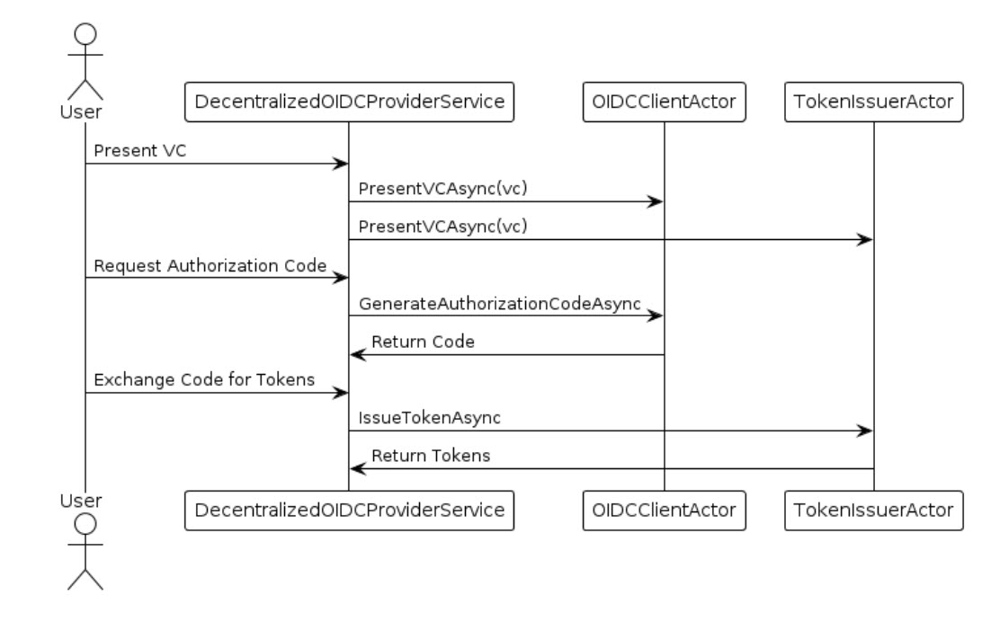
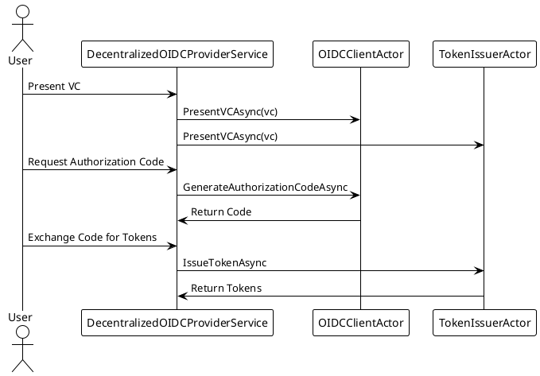

### Sequence Diagram

# Software Design Specification (SDS)
## Canary OIDC with Verifiable Credentials Architecture

### Table of Contents
1. [Introduction](#introduction)
2. [Purpose](#purpose)
3. [System Overview](#system-overview)
4. [Actors and Components](#actors-and-components)
5. [Decentralized OIDC Workflow](#decentralized-oidc-workflow)
6. [Detailed Component Descriptions](#detailed-component-descriptions)
7. [Verifiable Credentials Integration](#verifiable-credentials-integration)
8. [Sequence Diagrams](#sequence-diagrams)
9. [Conclusion](#conclusion)

### Introduction

This document outlines the design specifications for the `Canary OIDC with Verifiable Credentials (VC)` architecture. The system leverages decentralized identity principles and Verifiable Credentials to create a secure, scalable, and flexible OpenID Connect (OIDC) provider.

### Purpose

The purpose of this architecture is to enable a decentralized and secure OIDC provider that uses Verifiable Credentials to manage authentication flows dynamically. The system utilizes a combination of `Dapr Actors`, `Token Issuance`, and `Client Management` to ensure secure and verified identity management across distributed components.

### System Overview

The `Canary OIDC with Verifiable Credentials` architecture aims to provide a decentralized OIDC provider that integrates with Verifiable Credentials. This architecture includes the following key components:

- **DecentralizedOIDCProviderService**: Manages OIDC flows using VCs and interacts with actors.
- **OIDCClientActor**: Manages client information and handles authentication flows dynamically.
- **TokenIssuerActor**: Issues and validates JWT tokens dynamically based on VCs.
- **KeyManagementService**: Manages cryptographic keys used for signing and verifying tokens.
- **CryptoService**: Provides cryptographic operations such as signing, verifying, and random byte generation.

### Actors and Components

1. **OIDCClientActor**: 
    - Handles OIDC client operations such as initiating authentication flows and handling token exchanges.
    - Manages client information and retrieves configuration dynamically from presented VCs.

2. **TokenIssuerActor**: 
    - Issues JWT tokens and handles their validation.
    - Retrieves dynamic configuration values from VCs and manages token issuance securely.

3. **DecentralizedOIDCProviderService**: 
    - Manages the interaction between different actors and VCs.
    - Responsible for retrieving VCs, presenting them to actors, and coordinating the OIDC workflow.

4. **Verifiable Credential (VC)**: 
    - A credential format that carries identity information and can be cryptographically verified.
    - VCs are presented to actors to initialize their state and manage configuration dynamically.

### Decentralized OIDC Workflow

1. **VC Presentation**: 
    - A user presents a Verifiable Credential (VC) to authenticate.
    - The VC contains information such as `ClientId`, `ClientSecret`, `Issuer`, and `Audience`.

2. **Actor Initialization**:
    - The `DecentralizedOIDCProviderService` retrieves the VC based on the `ClientId`.
    - The service presents the VC to the appropriate actor (e.g., `OIDCClientActor` or `TokenIssuerActor`) to initialize the actor's state.

3. **Authorization Code Flow**:
    - The user requests an authorization code from the `DecentralizedOIDCProviderService`.
    - The service generates the authorization code and presents the VC to the `OIDCClientActor`.

4. **Token Issuance**:
    - The user exchanges the authorization code for an access token and ID token.
    - The `DecentralizedOIDCProviderService` retrieves the VC and presents it to the `TokenIssuerActor` for token issuance.

5. **Token Validation and User Info Retrieval**:
    - The `TokenIssuerActor` validates the token and retrieves user information.

### Detailed Component Descriptions

#### 1. **OIDCClientActor**
- **Responsibilities**: Manages OIDC client details, initiates authentication, and handles token exchanges.
- **State**: Stores the `ClientId`, `ClientSecret`, `Issuer`, and `Audience` from the presented VC.
- **Methods**:
  - `PresentVCAsync(VerifiableCredential vc)`
  - `InitiateAuthenticationAsync(...)`
  - `ExchangeAuthorizationCodeAsync(...)`
  - `ValidateTokenAsync(...)`

#### 2. **TokenIssuerActor**
- **Responsibilities**: Issues and validates JWT tokens based on information retrieved from VCs.
- **State**: Manages dynamic configuration settings (`Issuer`, `Audience`) retrieved from VCs.
- **Methods**:
  - `PresentVCAsync(VerifiableCredential vc)`
  - `IssueTokenAsync(...)`
  - `ValidateTokenAsync(...)`

#### 3. **DecentralizedOIDCProviderService**
- **Responsibilities**: Manages OIDC workflow and interaction between actors and VCs.
- **Methods**:
  - `GenerateAuthorizationCodeAsync(...)`
  - `ExchangeAuthorizationCodeAsync(...)`
  - `GetUserInfoAsync(...)`

### Verifiable Credentials Integration

- VCs are integrated into the OIDC workflow to provide decentralized and dynamic identity management.
- The `DecentralizedOIDCProviderService` retrieves VCs, presents them to the appropriate actors, and ensures that actors manage their state securely based on these credentials.
- VCs are verified and trusted, ensuring secure authentication flows.

### Sequence Diagram UML code

### Conclusion

The `Canary OIDC with Verifiable Credentials Architecture` provides a secure and decentralized approach to managing identity using OpenID Connect. By leveraging Verifiable Credentials, the system ensures that all authentication and authorization flows are dynamic, verified, and scalable.

